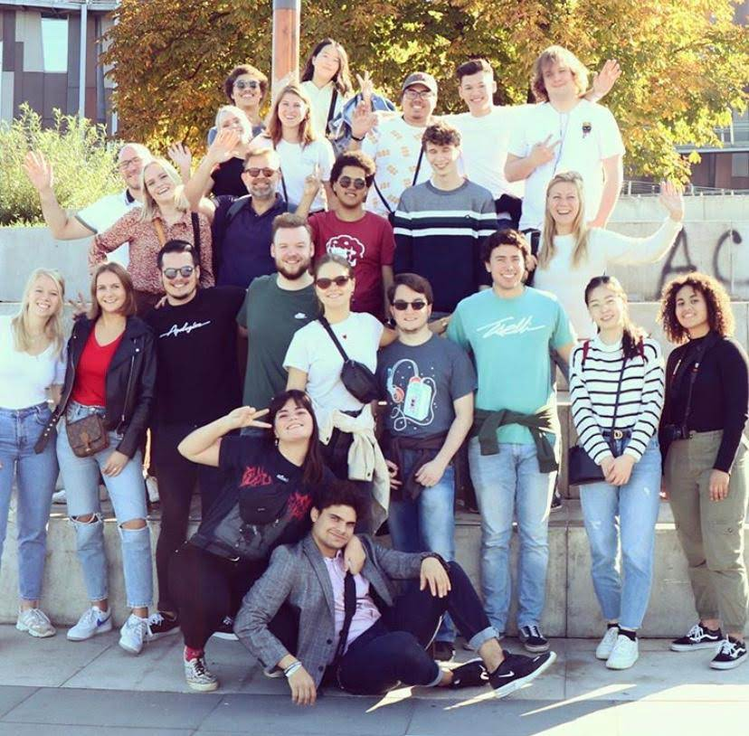

# Studytrip Warsaw

During the week of 19 to 26 October 2019 a group of 24 [design students](https://www.cmd-amsterdam.nl/) visited Warsaw to get a taste of Polish culture and design thinking.
This repo is an collaborative effort to recap our trip and archive our findings aswell to provide more background information to the things we found out or were presented.

---

## Week planning

- [Day one - 19 October](docs/19oct.md)
- [Day two - 20 October](docs/20oct.md)
- [Day three - 21 October](docs/21oct.md)
- [Day four - 22 October](docs/22oct.md)
- [Day five - 23 October](docs/23oct.md)
- [Day six - 24 October](docs/24oct.md)
- [Day seven - 25 October](docs/25oct.md)
- [Day eight - 26 October](docs/26oct.md)

## To collaborators/students

Use the corresponding day to add the following:

- Notes
- Links
- Pictures
- (News)Articles
- Activities
- Slides/presentations
